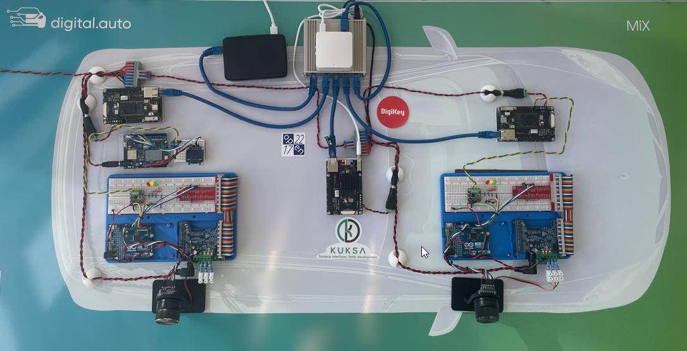

# What is in?
Realtime & MW agnostic OOP C++ application to control & synchronize multiple smart actuators connected via zone µCs from zentral µP vehicle computer.

"Everything" runs and is scheduled in a 1 millisecond task.



# Install libs

General OS requirement for the local build is Ubuntu 24.04.
```console
sudo apt update
sudo apt install libmosquitto-dev libjsoncpp-dev libprotobuf-dev libgrpc-dev libre2-dev libgrpc++-dev build-essential autoconf libtool protobuf-compiler-grpc libspdlog-dev libyaml-cpp-dev -y
```

# Build from source, config & run (requires Linux preempt RT)
```console
git submodule update --init --recursive
./build.sh
./build/haptic_force_controller starterkit_config.yaml
```

The executable takes a config yaml file as parameter: `./build/haptic_force_controller <config.yaml>`

# Building docker
Docker can be built, in the root of this repo with

```
  docker build -t cpp_hfc_image:latest -f dockerfiles/Dockerfile.ew  . 
```

# Running Docker
Start it like this for starterkit project (using starterkit_config.yaml as default config)
```
docker run -it  --network host --cap-add=ALL --security-opt seccomp=unconfined --privileged --name cpp_haptic_controller_run cpp_hfc_image:latest
```

Alternatively, if you want to pass a different YAML config file, e.g. pass the `my_config.yaml` to the docker container without rebuilding the docker image, you can run

```
sudo docker run -it -v ./my_config.yaml:/workspace/config.yaml  --network host --cap-add=ALL --security-opt seccomp=unconfined --privileged cpp_hfc_image:latest /workspace/haptic/build/haptic_force_controller  /workspace/my_config.yaml
```

# Cross Compile
In case you have the different CPU architecture on your build machine 

```
docker buildx  build --platform linux/arm64  -t cpp_hfc_image:latest -f dockerfiles/Dockerfile.ew  .
```

Copy docker image to target host

```
docker save cpp_hfc_image:latest -o ~/cpp-hfc-image.tar

scp ~/cpp-hfc-image.tar [target pc destination e.g. fio@192.168.88.11:/home/fio]

```

Load image and run it

```
docker image load < ~/cpp-hfc-image.tar

docker run -it  --network host --cap-add=ALL --security-opt seccomp=unconfined --privileged --name cpp_haptic_controller_run cpp_hfc_image:latest

```

